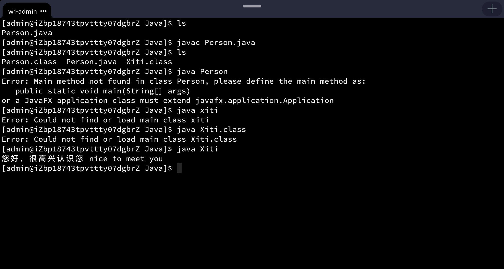

[TOC]

------

# 1. 问答题

## (1) Java 语言的主要贡献者是谁？

James Gosling

## (2) 开发 Java 应用程序需要经过哪些主要步骤？

编辑 -> 编译 -> 运行

## (3) Java 源文件是由什么组成的？一个源文件中必须要有 public 类吗？

由类组成。不一定必须要有 public 类。（但 public 类最多只能有一个）

## (4) 如果 JDK 的安装目录是 D:/jdk，应当怎样设置 path 和 classpath 的值？

path 添加两条：`D:/ jdk/bin; D:/jdk/jre/bin; ` 

classpath一般不用设置。

## (5) Java 源文件的扩展名是什么？Java 字节码的扩展名是什么？

Java 源文件：.java；字节码文件：.class

## (6) 如果 Java 应用程序主类的名字是 Bird，编译之后，应当怎样运行该程序？

```bash
java Bird
```

## (7) 有哪两种编程风格，在格式上各有怎样的特点？

Allmans 风格（独行风格）与 Kernighan 风格（行尾风格）。

# 3. 阅读程序

> ## 阅读下列 Java 源文件，并回答问题。
>
> ```java
> public class Person {
> 	void speakHello() {
> 		System.out.print("您好，很高兴认识您");
> 		System.out.println(" nice to meet you");
> 	}
> }
> class Xiti {
> 	public static void main(String[] args) {
> 		Person zhang = new Person();
> 		zhang.speakHello();
> 	}
> }
> ```

## (1) 上述源文件的名字是什么？

Person.java

## (2) 编译上述源文件将生成几个字节码文件？这些字节码文件的名字都是什么？

两个：Person.class和Xiti.class。

## (3) 在命令行执行 `java Person` 得到怎样的错误提示？执行 `java xiti` 得到怎样的错误提示？执行 `java Xiti.class` 得到怎样的错误提示？执行 `java Xiti` 得到怎样的输出结果？

如以下shell所示。

```shell
[admin@iZbp18743tpvttty07dgbrZ Java]$ ls
Person.java
[admin@iZbp18743tpvttty07dgbrZ Java]$ javac Person.java 
[admin@iZbp18743tpvttty07dgbrZ Java]$ ls
Person.class  Person.java  Xiti.class
// 注：生成两个文件。
[admin@iZbp18743tpvttty07dgbrZ Java]$ java Person
Error: Main method not found in class Person, please define the main method as:
   public static void main(String[] args)
or a JavaFX application class must extend javafx.application.Application
// 注：找不到main函数：Person不是主类。
[admin@iZbp18743tpvttty07dgbrZ Java]$ java xiti
Error: Could not find or load main class xiti
// 注：Java是大小写敏感的。
[admin@iZbp18743tpvttty07dgbrZ Java]$ java Xiti.class
Error: Could not find or load main class Xiti.class
// 注：Java执行字节码时，应该java [类名]，不能加扩展名。
[admin@iZbp18743tpvttty07dgbrZ Java]$ java Xiti
您好，很高兴认识您 nice to meet you
[admin@iZbp18743tpvttty07dgbrZ Java]$
```

