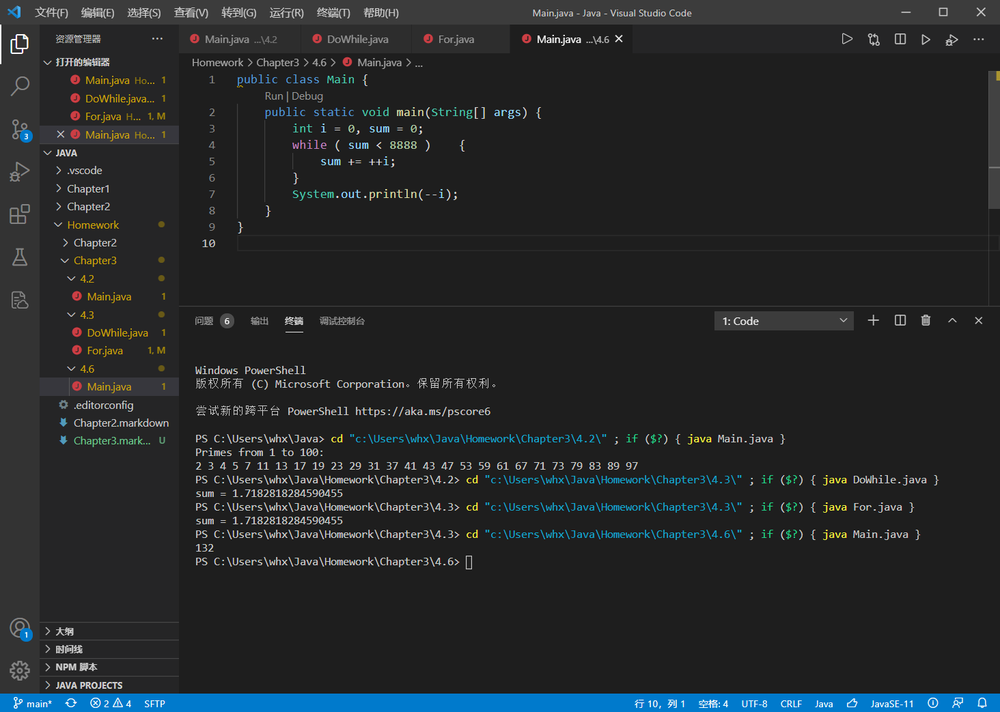

[TOC]

---

# 4. 编程题

## (2) 编写一个应用程序求 100 以内的全部素数。

因侧重点不在算法，故直接暴力双重循环输出。

```java
public class Main {
	public static void main(String args[]) {
		System.out.println("Primes from 1 to 100: ");
		for ( int i = 2; i < 100; i++ ) {
			boolean isPrime = true;
			for ( int j = 2; j < i/2; j++) {
				if ( i%j == 0 ) {
					isPrime = false;
				}
			}
			if ( isPrime ) {
				System.out.print(i+" ");
			}
		}
		System.out.println();
	}
}
```

```powershell
PS C:\Users\whx\Java\Homework\Chapter3\4.2> cd "c:\Users\whx\Java\Homework\Chapter3\4.2\" ; if ($?) { java Main.java }
Primes from 1 to 100: 
2 3 4 5 7 11 13 17 19 23 29 31 37 41 43 47 53 59 61 67 71 73 79 83 89 97
```

## (3) 分别用 do-while 和 for 循环计算 1+1/2!+1/3!+1/4!+… 的前 20 项和。

这题没有太多难点。

```java
public class DoWhile {
    public static void main(String[] args) {
        double sum = 0.0;
        double pdt = 1.0;
        int i = 1;
        do {
            pdt *= i;
            sum += 1/pdt;
        } while ( i++ < 20 );
        System.out.println("sum = "+sum);
    }
}
```

```java
public class For {
    public static void main(String[] args) {
        double pdt = 1.0, sum = 0.0;
        for ( int i = 1; i <= 20; i++ ) {
            pdt *= i;
            sum += 1/pdt;
        }
        System.out.println(sum);
    }
}
```

```powershell
PS C:\Users\whx\Java\Homework\Chapter3\4.3> cd "c:\Users\whx\Java\Homework\Chapter3\4.3\" ; if ($?) { java DoWhile.java }
sum = 1.7182818284590455
PS C:\Users\whx\Java\Homework\Chapter3\4.3> cd "c:\Users\whx\Java\Homework\Chapter3\4.3\" ; if ($?) { java For.java }
sum = 1.7182818284590455
```

## (6) 编写应用程序，输出满足 1+2+3+…+n<8888 的最大正整数 n 。

考察计算思维。使用 while 循环加到条件不满足，再减一即可。

```java
public class Main {
    public static void main(String[] args) {
        int i = 0, sum = 0;
        while ( sum < 8888 )    {
            sum += ++i;
        }
        System.out.println(--i);
    }
}
```

```powershell
PS C:\Users\whx\Java\Homework\Chapter3\4.6> cd "c:\Users\whx\Java\Homework\Chapter3\4.6\" ; if ($?) { java Main.java }
132
```

